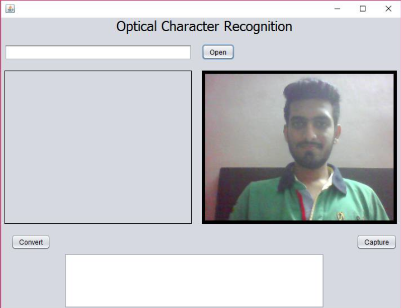
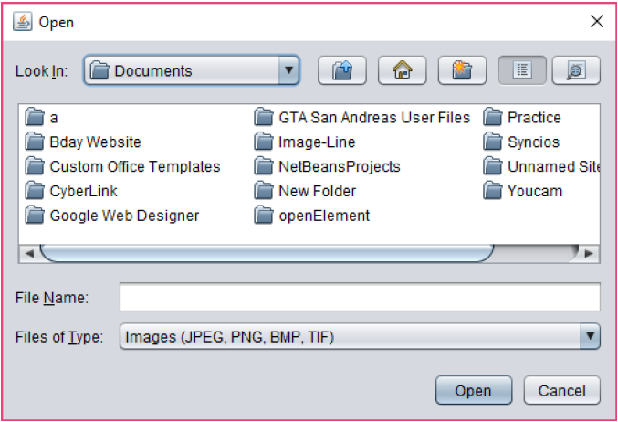
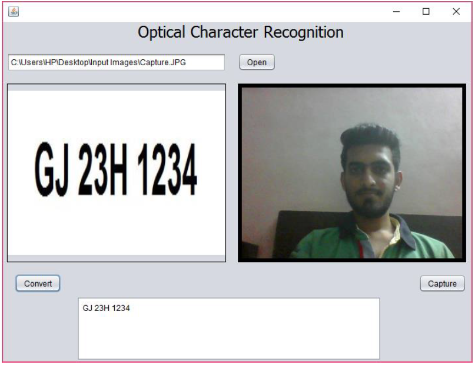

# Optical Character Recognition using Tesseract/Java Webcam Capture API
Optical Character Recognition system is used to convert text in an image into text format. This system smartly recognizes text from an image. This is also trained to recognize handwritten text with an accuracy of about 52%. Printed text is identified with an accuracy of 96%. It can read all types of image formats including JPEG, PNG, BMP and TIF. Moreover, it can even read from PDF files. This system can also read characters from webcam and convert it into text. This can be used on Toll Booths to read number plates of different cars passing through the booth. This can save manual hard work and time. It has a GUI based system, in which we can select an image either from our hard-disk or capture it through the webcam.

# Training Tools
* JTessBoxEditorFX
* ML_OCR Tool

# System Images

